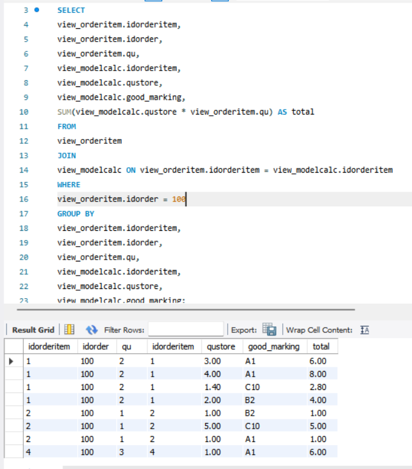
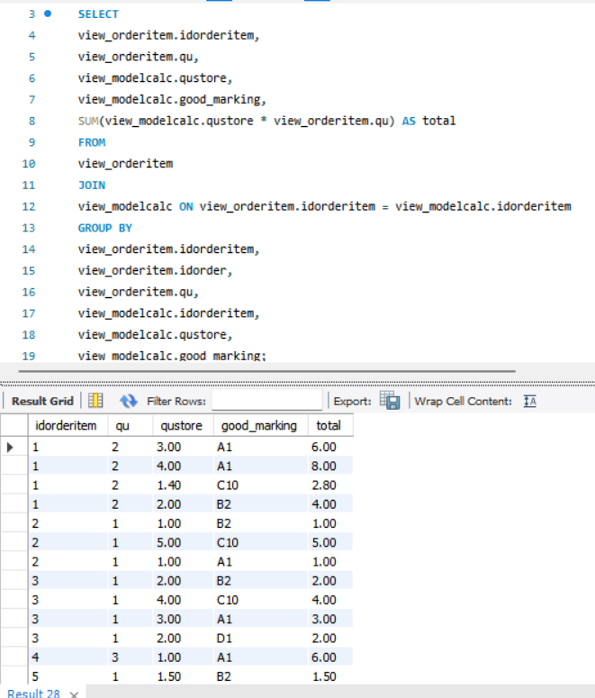
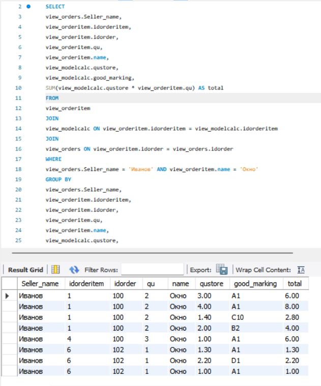

Составить запросы. 
1.	Сколько каждого материала должно уходить на каждый заказ? (итоговая сумма)
	
SELECT 
view_orderitem.idorderitem,
view_orderitem.idorder,
view_orderitem.qu,
view_modelcalc.idorderitem,
view_modelcalc.qustore,
view_modelcalc.good_marking,
SUM(view_modelcalc.qustore * view_orderitem.qu) AS total
FROM
view_orderitem
JOIN
view_modelcalc ON view_orderitem.idorderitem = view_modelcalc.idorderitem
WHERE
view_orderitem.idorder = 100 //тут меняется значение и выводится информация на другие заказы.
GROUP BY
view_orderitem.idorderitem,
view_orderitem.idorder,
view_orderitem.qu,
view_modelcalc.idorderitem,
view_modelcalc.qustore,
view_modelcalc.good_marking;
	
	

	
2.	Сколько всего материалов каких материалов должно уйти на все заказы? 
	
SELECT 
view_orderitem.idorderitem,
view_orderitem.qu,
view_modelcalc.qustore,
view_modelcalc.good_marking,
SUM(view_modelcalc.qustore * view_orderitem.qu) AS total
FROM
view_orderitem
JOIN
view_modelcalc ON view_orderitem.idorderitem = view_modelcalc.idorderitem
GROUP BY
view_orderitem.idorderitem,
view_orderitem.idorder,
view_orderitem.qu,
view_modelcalc.idorderitem,
view_modelcalc.qustore,
view_modelcalc.good_marking; 
	
	

	 
	
	
3.	Сколько и какого материала должно уйти на изделия Окно для продавца Иванова
	
SELECT 
view_orders.Seller_name,
view_orderitem.idorderitem,
view_orderitem.idorder,
view_orderitem.qu,
view_orderitem.name,
view_modelcalc.qustore,
view_modelcalc.good_marking,
SUM(view_modelcalc.qustore * view_orderitem.qu) AS total
FROM
view_orderitem
JOIN
view_modelcalc ON view_orderitem.idorderitem = view_modelcalc.idorderitem
JOIN
view_orders ON view_orderitem.idorder = view_orders.idorder
WHERE
view_orders.Seller_name = 'Иванов' AND view_orderitem.name = 'Окно'
GROUP BY
view_orders.Seller_name,
view_orderitem.idorderitem,
view_orderitem.idorder,
view_orderitem.qu,
view_orderitem.name,
view_modelcalc.qustore,
view_modelcalc.good_marking;
		

